# Multi-Tenant Driving School Management System SaaS — System Architecture & Development Blueprint

**Document type:** Comprehensive, production-ready System Architecture Design and Development Blueprint
**Audience:** Engineering team building the platform from this document
**Localization scope:** English (default), Amharic (አማርኛ), Afaan Oromoo
**Calendar scope:** Gregorian (storage) + Ethiopian (display, via EthDatePicker)

---

## 1. Executive Summary

This document defines the architecture, database design, APIs, security model, and deployment strategy for a **multi-tenant Driving School Management System SaaS platform**. Each tenant is an independent driving school — a small family-run school, a mid-sized academy, or a national chain — that shares one platform while keeping its data, branding, locale, and operations fully isolated.

### Target users
- **Driving school operators** managing instructors, vehicles, learner enrollments, and statutory exam bookings.
- **Driving instructors** delivering theory and practical lessons, logging progress, scheduling their own calendar.
- **Learners (students)** booking lessons, tracking their hours, viewing lesson feedback and progress.
- **Parents / sponsors** following a learner's progress and paying installments.
- **Branch managers** running a single branch of a multi-branch school.
- **Super Admin (platform owner)** onboarding new driving schools and managing the platform itself.

### Value proposition
The platform replaces the paper logbooks, WhatsApp scheduling, and spreadsheet fee tracking that dominate Ethiopian driving schools today. A school gets a single system that handles enrollment, lesson scheduling, vehicle management, learner progress tracking, payment collection, and statutory exam preparation — with native Amharic and Afaan Oromoo interfaces and an Ethiopian calendar that matches how schools actually schedule lessons.

### How the stack meets the brief
A single-page React application consuming Supabase's auto-generated REST API gives the team a path to ship a multi-tenant product in weeks, not months. Supabase Postgres, Row Level Security, Auth, Storage, and Edge Functions cover nearly every backend need out of the box, so the team only writes custom server-side code for payments, scheduled jobs, and report generation. Cost stays low until a tenant base forms, because there is no always-on application server to scale.

---

## 2. User Roles and Functional Modules

### User roles
| Role | Scope | Notes |
|---|---|---|
| `super_admin` | Platform | Onboards new driving schools, manages billing, monitors the platform. |
| `school_admin` | One tenant | The school owner or general manager. Full control inside the tenant. |
| `branch_manager` | One branch | Optional, used by multi-branch schools. |
| `instructor` | Self + assigned learners | Driving instructor. |
| `examiner` | Self | Internal examiner, records mock-exam results. May overlap with `instructor`. |
| `learner` | Self | The driving school student. |
| `parent` | Linked learners | Sponsor / parent. Read-mostly access to linked learners' progress. |
| `accountant` | Tenant finance | Read access to financial data; manages refunds and reconciliations. |
| `receptionist` | Tenant front desk | Books lessons, takes payments, enrolls new learners. |

### Core modules
1. **Learner Information Management** — profiles, license category applied for, enrollment date, branch, sponsor, KYC documents.
2. **Instructor Management** — qualifications, license categories they are certified to teach, vehicle assignments, availability calendar.
3. **Vehicle & Fleet Management** — vehicles, plate numbers, transmission type (manual/automatic), fuel logs, maintenance schedule, odometer, insurance, fitness certificates.
4. **Course & Package Management** — license categories (Ethiopian: 1–6), course packages (e.g., 20-hour basic, 30-hour advanced, 40-hour automatic), hour bank, expiry rules.
5. **Lesson Scheduling** — theory slots, practical slots, simulator slots, group vs. one-on-one, recurring availability.
6. **Lesson Delivery & Attendance** — instructor starts/ends a lesson, captures pre/post notes, marks attendance and hours completed.
7. **Skill Evaluation & Progress Tracking** — per-skill checklist (parking, hill start, highway, night driving, defensive driving), instructor feedback, learner self-evaluation.
8. **Theory & Mock Exam Management** — internal question bank, mock exams, scoring, pass/fail.
9. **Fee Management & Online Payments** — package fees, installment plans, payments, receipts, refunds. Telebirr/Chapa/SantimPay/CBE Birr integration later.
10. **Communication Hub** — in-app notifications, email, SMS, push. Templates localized per language.
11. **Reporting & Analytics** — learner funnel, instructor utilization, vehicle utilization, revenue, hours delivered, exam pass rate.
12. **ID Card Printing & Management** — templates, photo capture, single and batch card generation, print queue, reprint tracking, expiry, lost/replace workflow.
13. **Certificate Issuance & Printing** — certificate templates (course completion, hours completion, skill mastery, mock exam pass), unique verification codes, PDF generation, single + batch printing, reissue and revocation, public verification portal.
14. **Public Online Registration** — unauthenticated, tenant-aware public form for prospective learners to register interest, upload KYC, pick license category and preferred schedule; admin review queue converts submissions to active learners.
15. **Template Designer (ID Card & Certificate)** — visual drag-and-drop editor with snap-to-grid, alignment guides, multi-page support (front/back for ID cards), per-element styling, dynamic-data tokens, asset library (logo, background, signature), version history, clone from existing template, preview with sample data, publish-as-active.
16. **Administrative Settings** — branch setup, license categories, fee structure, branding, locale, date calendar, working hours.

### Out of scope (initial)
- National licensing authority integration (read-only sync can come in Phase 4).
- Vehicle GPS tracking.
- Learner self-paced online theory (possible Phase 4).
- Physical smartcard encoding (magnetic stripe / NFC) — PDF + print only in the initial release.

---

## 3. Architectural Design Principles

1. **Security-first** — tenant isolation is enforced by Row Level Security on every table. No custom API can bypass it.
2. **Serverless simplicity** — no long-running application server. Supabase managed services carry the load.
3. **Type-safety end-to-end** — database types are generated into TypeScript and reused from Edge Functions to React components.
4. **Locale-first UX** — every string is a translation key; every date is a `tenant_settings.calendar` decision at render time.
5. **Optimistic UI** — TanStack Query gives the user instant feedback on lesson attendance, evaluation submission, and vehicle check-in.
6. **Edge-only custom logic** — Edge Functions handle payments, bulk notifications, PDF generation, and scheduled jobs. Everything else hits PostgREST.
7. **Auditability** — sensitive tables (payments, evaluations, vehicle maintenance, exam results) have trigger-based audit logs.
8. **Graceful degradation** — if Supabase is briefly unreachable, TanStack Query's cache keeps the UI usable with stale data and a clear offline indicator.

---

## 4. High-Level System Architecture

```mermaid
flowchart LR
  subgraph Client["Browser — React 18 + TypeScript SPA"]
    UI[shadcn/ui + Tailwind]
    I18N[i18next<br/>en / am / om]
    ETH[EthDatePicker<br/>+ gregorian converters]
    RQ[TanStack Query]
    RH[React Hook Form + Zod]
  end

  subgraph Supabase["Supabase Managed Cloud"]
    Auth[Supabase Auth]
    PostgREST[PostgREST<br/>auto-generated REST]
    PG[(Postgres<br/>RLS-enforced)]
    Storage[Supabase Storage<br/>vehicle photos, KYC, receipts]
    Edge[Edge Functions (Deno)]
    RT[Realtime<br/>lesson status, announcements]
  end

  subgraph External["External Services"]
    SMS[SMS Provider<br/>e.g., Afromessage]
    Email[Email<br/>Resend / SendGrid]
    Pay[Payment Providers<br/>Telebirr / Chapa / Stripe]
    Push[Push — optional]
  end

  UI -->|HTTPS / JWT| PostgREST
  UI -->|Auth| Auth
  UI -->|Direct upload via signed URLs| Storage
  UI -->|Subscribe| RT
  RQ --> PostgREST
  Edge -->|webhook / call| Pay
  Edge -->|HTTP| SMS
  Edge -->|HTTP| Email
  Edge -->|cron| Edge
  PostgREST --> PG
  Auth --> PG
  Edge --> PG
  RT --> PG
```

### How the SPA talks to Supabase
The React app authenticates against Supabase Auth and receives a JWT containing `auth.uid()` and a `tenant_id` claim. The SPA's TanStack Query layer calls `supabase.from(...).select(...)` against PostgREST. RLS policies on every table filter rows by tenant and role before any data leaves Postgres. The SPA does not need — and is not trusted with — a custom API layer.

### Authentication flow
1. User submits email + password (or magic link) to `supabase.auth.signInWithPassword`.
2. Supabase returns a JWT that includes `auth.uid()` and a custom `tenant_id` claim.
3. A custom access token hook (`public.custom_access_token_hook`) injects `tenant_id` and `role` from the `public.users` table into the JWT.
4. Every PostgREST request carries the JWT; RLS policies use the embedded claims to authorize.

### When Edge Functions are used
- Payment intents and webhook handlers.
- Bulk SMS / email sends (rate-limited, queued).
- PDF generation (progress reports, receipts, exam certificates).
- Scheduled jobs (lesson reminders, vehicle maintenance reminders, expired enrollment alerts).
- Tenant onboarding (creating the tenant record, initial admin user, default settings).

---

## 5. Multi-Tenancy Strategy

### Chosen model: **Shared database, shared schema, with mandatory `tenant_id` and RLS**
A single Postgres database, a single schema, one row per logical entity, with a non-nullable `tenant_id uuid` column. RLS is the only thing that prevents cross-tenant reads. This model is the simplest to operate, the cheapest, and works well with PostgREST because RLS plugs into the connection's JWT.

Rejected alternatives:
- **Schema-per-tenant**: harder to operate, breaks PostgREST ergonomics, complicates migrations.
- **Database-per-tenant**: operationally heavy, not needed at this scale, expensive on Supabase.

### RLS baseline
Every tenant-scoped table includes:
- `tenant_id uuid not null references public.tenants(id)`
- An index on `(tenant_id, <most common query column>)`
- RLS enabled (`alter table ... enable row level security;`)
- A baseline policy pattern:
  ```sql
  create policy "tenant isolation"
  on public.learners
  for all
  using (tenant_id = (select get_tenant_id_from_jwt()))
  with check (tenant_id = (select get_tenant_id_from_jwt()));
  ```
- A `super_admin` bypass policy that checks a `super_admin_emails` allowlist or a `is_super_admin()` function.

### Tenant onboarding
A `super_admin` triggers a `create-tenant` Edge Function that:
1. Inserts a row in `public.tenants` with name, default locale, default calendar, currency, time zone (default `Africa/Addis_Ababa`).
2. Inserts default `tenant_settings` (working hours, license categories enabled, default course packages).
3. Creates the first `school_admin` user via `supabase.auth.admin.createUser` and inserts into `public.users`.
4. Returns a magic link invitation email.

### Tenant-level customization
Stored in `public.tenant_settings` as a JSONB column plus typed columns for high-traffic reads:
```sql
create table public.tenant_settings (
  tenant_id uuid primary key references public.tenants(id) on delete cascade,
  default_locale text not null default 'en' check (default_locale in ('en','am','om')),
  date_calendar text not null default 'ethiopian' check (date_calendar in ('ethiopian','gregorian')),
  timezone text not null default 'Africa/Addis_Ababa',
  currency text not null default 'ETB',
  working_hours jsonb not null default '{"mon":["08:00-18:00"], ...}',
  enabled_license_categories text[] not null default array['B']::text[],
  brand jsonb not null default '{}'::jsonb
);
```

---

## 6. Frontend Architecture & Routing

### Folder structure (feature-based)
```
src/
  app/                        # router, providers, root layout
  features/
    auth/
    tenants/                  # super_admin only
    learners/
    instructors/
    vehicles/
    courses/
    lessons/
    evaluations/
    exams/
    payments/
    reports/
    communication/
  components/
    ui/                       # shadcn/ui primitives
    layout/                   # AppShell, Sidebar, Topbar
    ethiopian-calendar/       # EthDatePicker wrapper + converters
    data-table/
  hooks/                      # shared hooks
  lib/
    supabase.ts               # generated client
    i18n.ts                   # i18next setup
    eth-calendar.ts           # gregorian ↔ ethiopian conversions
    auth-context.tsx
  locales/
    en/common.json
    am/common.json
    om/common.json
  routes.tsx
  main.tsx
```

### Routing (React Router v6)
- Nested layouts: `/app` requires auth, `/app/manage/:tenantSlug` requires `school_admin`, `/app/manage/:tenantSlug/finance` requires `accountant` or `school_admin`.
- A `RequireRole` wrapper reads role from `useAuth()` and redirects unauthorized users to `/forbidden`.
- All routes are tenant-scoped; the URL never lets you accidentally operate on the wrong tenant.
- Template designer routes (school_admin only):
  - `/app/manage/:tenantSlug/templates/id-cards` — list of ID card templates.
  - `/app/manage/:tenantSlug/templates/id-cards/:id/edit` — drag-and-drop editor for one ID card template.
  - `/app/manage/:tenantSlug/templates/certificates` — list of certificate templates.
  - `/app/manage/:tenantSlug/templates/certificates/:id/edit` — drag-and-drop editor for one certificate template.
  - `/app/manage/:tenantSlug/templates/assets` — tenant asset library (logos, backgrounds, signatures).
  - `/app/manage/:tenantSlug/print-station` — print queue, live job status, batch selection (receptionist + school_admin).

### State management
- **Server state** — TanStack Query. Cache keys include the `tenantId` so two tenants are never confused.
- **Form state** — React Hook Form + Zod. Zod schemas are shared between client validation and Edge Function input parsing.
- **UI state** — minimal React context (auth, current tenant, current locale, calendar preference).
- **No global Redux/Zustand** for this phase. Add later only if a real need shows up.

### UI / styling
- Tailwind CSS for all styling.
- shadcn/ui for primitives; wrap them in `components/ui/` and never edit the generated files directly.
- A custom `<EthDatePicker />` component built on shadcn's Popover + Calendar, using the Ethiopian month grid, and exposing both Ethiopian and Gregorian values.

### Internationalization (i18n) strategy
- **Library:** `i18next` + `react-i18next` + `i18next-browser-languagedetector`.
- **Locales:** `en` (default), `am` (Amharic), `om` (Afaan Oromoo).
- **Translations live** in `src/locales/<locale>/<namespace>.json` and are split by namespace (`common`, `learners`, `lessons`, `payments`, etc.) so unused namespaces are not shipped.
- **Language detection order:** explicit user choice in profile → tenant default → browser `navigator.language` → `en`.
- **Persistence:** `i18next-browser-languagedetector` with `localStorage`.
- **Fonts:** Amharic uses `Noto Sans Ethiopic`; Latin scripts use `Inter`. Fonts are loaded with `font-display: swap` from a small self-hosted set to keep the bundle lean.
- **Direction:** LTR for all three languages. (Amharic is Ge'ez script but Latin-ordered; no RTL work needed.)
- **Numbers, currency, dates:** use `Intl.NumberFormat` and `Intl.DateTimeFormat` with the active locale. Currency defaults to `ETB` from `tenant_settings.currency`.
- **Lazy loading:** locales are loaded with `i18next-http-backend` and per-namespace `loadPath` so the initial bundle is small.
- **Server-rendered strings (Edge Functions):** email and SMS templates use the same translation files, read from a shared `locales/` directory at the project root and imported at function startup.

### EthDatePicker integration
The picker is a single component that:
1. Takes a value as a Gregorian ISO string (storage format) and a display calendar preference.
2. Renders the Ethiopian month grid (12 × 30 + Pagume of 5 or 6) when `displayCalendar === 'ethiopian'`.
3. Converts on the fly using a tested `eth-calendar.ts` utility.
4. Emits both an Ethiopian display label (e.g., `ጥቅምት 15, 2018`) and the underlying Gregorian `YYYY-MM-DD` for form submission.
5. Works inside React Hook Form via a controlled adapter.

Conversion utility contract:
```ts
// eth-calendar.ts
export function gregorianToEthiopian(gDate: Date): EthiopianDate;
export function ethiopianToGregorian(eDate: EthiopianDate): Date;
export function formatEthiopian(eDate: EthiopianDate, locale: 'en'|'am'|'om'): string;
```
- Internal store: **always Gregorian `timestamptz`** in Postgres.
- Render: the calendar picker decides which grid to show, using the active tenant setting as the default.
- Validation: a Zod schema can be parameterized to accept either calendar but always normalizes to Gregorian before submission.

---

## 6A. Template Designer Architecture (ID Card & Certificate)

The same drag-and-drop editor powers both ID card templates and certificate templates. The only difference is the canvas dimensions and the element whitelist (ID cards get a QR / barcode element; certificates get a signature image element). The editor is a single React app, fed by a `template` JSON document and a token catalog.

### Library choice
- **Canvas:** `react-konva` (React bindings for Konva). Mature, fast, plays well with TypeScript, has built-in `Transformer` for resize and rotate, supports snap-to-grid and z-index layers.
- **PDF rendering for preview and final output:** `pdf-lib` (server-side, in Edge Functions) and `react-pdf` (client-side preview only). `react-konva` is the editor; the JSON layout is rendered to PDF at save / issue time by `pdf-lib` on the server. This separation means the editor never produces a PDF — it produces a layout document, and the same document is the source of truth for both preview and final print.
- **Drag UX helpers:** `react-konva-utils` for snap-to-grid and `konva-alignment-guides` (or a small custom hook) for live alignment guides.
- **Forms / inspector panel:** React Hook Form + Zod, with a separate Zod schema for the layout document.
- **State for the editor:** local component state for the live canvas; autosave to Supabase every 5 seconds and on blur of any field, with a debounced `upsert` of the `layout` JSONB.

### Folder structure
```
src/features/template-designer/
  pages/
    id-card-list.tsx
    id-card-edit.tsx
    certificate-list.tsx
    certificate-edit.tsx
  components/
    canvas/
      KonvaCanvas.tsx         # the editable canvas
      elements/
        TextElement.tsx
        ImageElement.tsx
        QrElement.tsx
        BarcodeElement.tsx
        ShapeElement.tsx
        SignatureElement.tsx
      TransformerWrapper.tsx  # resize + rotate handles
      SnapGrid.tsx
      AlignmentGuides.tsx
      Ruler.tsx
    inspector/
      InspectorPanel.tsx      # right rail, context-sensitive to selected element
      PropertyField.tsx
      TokenPalette.tsx        # drag tokens from here onto text elements
      LayerPanel.tsx          # z-index / visibility / lock
    toolbar/
      TopToolbar.tsx
      ZoomControls.tsx
      UndoRedo.tsx            # command pattern with a bounded history stack
    preview/
      PreviewDialog.tsx       # renders the layout with sample data via pdf-lib
  lib/
    layout-doc.ts             # Zod schema for the layout document
    layout-pdf.ts             # layout doc -> pdf-lib draw calls (reused on the client and in Edge Functions)
    sample-data.ts            # fixture data for preview
    tokens.ts                 # the catalog of dynamic-data tokens
    history.ts                # undo / redo store
  hooks/
    useDesignerState.ts
    useAutosave.ts
    useAlignmentGuides.ts
  routes.tsx
```

### Canvas dimensions
| Template | Page size | Orientation |
|---|---|---|
| ID card, front | CR80 — 85.6 mm × 53.98 mm (3.375" × 2.125") | Landscape |
| ID card, back | CR80 — same | Landscape |
| Certificate | A4 — 210 mm × 297 mm | Landscape by default; portrait is selectable per template |
| Certificate (US) | Letter — 8.5" × 11" | Landscape by default |

The editor stores dimensions in **PostScript points** (`pt`) — 72 pt = 1 in — so PDF rendering is lossless. The canvas shows a 1:1 pixel preview at 300 DPI when zoom = 100%, which matches the print resolution.

### Element types
- **Text** — free text or a token. Style: font family (per locale; Amharic falls back to `Noto Sans Ethiopic`), size, weight, color, alignment, line height, letter spacing, max width with auto-wrap.
- **Image** — uploaded asset from the tenant asset library. Resize modes: `cover`, `contain`, `stretch`.
- **Shape** — rectangle, rounded rectangle, ellipse, line, divider. Stroke + fill.
- **QR code** — encodes either a fixed URL (per template) or a token URL such as `https://verify.example.com/c/{{certificate.verification_code}}` for certificates. Error correction level configurable.
- **Barcode** — Code 128 or Code 39. Used for the card number on ID cards.
- **Signature / seal** — uploaded asset, can be PNG with transparency, anchored to a fixed point.
- **Date field** — a special text element that auto-formats a date token in the active tenant's calendar and locale.
- **Page background** — a per-page fill (solid color, gradient, or image) set in the page panel, not in the elements list.

### Tokens (dynamic data)
A `tokens.ts` file declares the full token catalog. The token palette in the editor lists them grouped by namespace:
- `learner.full_name`, `learner.full_name_am`, `learner.full_name_om`
- `learner.card_number`, `learner.license_category_applied`
- `learner.photo_url`
- `instructor.full_name`, `instructor.license_number`
- `enrollment.course_name`, `enrollment.enrolled_at_eth`, `enrollment.enrolled_at_greg`, `enrollment.hours_completed`
- `certificate.verification_code`, `certificate.serial_number`, `certificate.issued_on_eth`, `certificate.issued_on_greg`
- `tenant.name`, `tenant.brand.logo_url`
- `system.today_eth`, `system.today_greg`

When a token is dropped into a text element, the element stores a list of mixed segments (literal text + token reference). At render time, `layout-pdf.ts` resolves the tokens against the record (learner, certificate, etc.) and the active locale and calendar. This is what makes the same template render in Amharic, Afaan Oromoo, or English, and in either calendar, without editing the template.

### Layout document schema (high level)
The `layout` JSONB has this shape (see Appendix H for the full Zod schema):
```ts
type LayoutDoc = {
  schemaVersion: "1.0";
  pages: Page[]; // 1 page for certificates, 2 for ID cards
  meta: { locale: "en" | "am" | "om"; calendar: "ethiopian" | "gregorian" };
};

type Page = {
  id: string;
  sizePt: { w: number; h: number };
  background: { type: "color"; value: string } | { type: "image"; assetId: string } | { type: "none" };
  elements: Element[];
};

type Element =
  | { id: string; type: "text"; x: number; y: number; w: number; h: number; rotation: number; z: number;
      segments: Array<{ kind: "text"; value: string } | { kind: "token"; path: string }>;
      style: TextStyle; }
  | { id: string; type: "image"; x: number; y: number; w: number; h: number; rotation: number; z: number;
      assetId: string; fit: "cover" | "contain" | "stretch"; }
  | { id: string; type: "shape"; x: number; y: number; w: number; h: number; rotation: number; z: number;
      shape: "rect" | "rounded" | "ellipse" | "line" | "divider";
      stroke: { color: string; widthPt: number }; fill: string | null; }
  | { id: string; type: "qr"; x: number; y: number; w: number; h: number; z: number;
      valueTemplate: string; ecLevel: "L" | "M" | "Q" | "H"; }
  | { id: string; type: "barcode"; x: number; y: number; w: number; h: number; z: number;
      valueTemplate: string; format: "code128" | "code39"; }
  | { id: string; type: "signature"; x: number; y: number; w: number; h: number; rotation: number; z: number;
      assetId: string; }
  | { id: string; type: "date"; x: number; y: number; w: number; h: number; rotation: number; z: number;
      tokenPath: string; format: string; /* Intl options */ };
```

### Editor UX details
- **Selection:** click selects, shift-click multi-selects, marquee selects.
- **Move:** drag with the mouse. Hold `Shift` to constrain to an axis. Hold `Alt` to duplicate on drop.
- **Resize / rotate:** drag the `Transformer` handles. Hold `Shift` to preserve aspect ratio. Rotation snaps to 15° steps.
- **Snap-to-grid:** 6 pt grid by default, toggleable. Smart guides appear when an element aligns horizontally or vertically with another.
- **Z-index:** drag in the `LayerPanel` to reorder; double-click to rename; right-click for lock / hide / delete.
- **Undo / redo:** `Ctrl/Cmd+Z`, `Ctrl/Cmd+Shift+Z`. History is a bounded ring buffer (50 commands) in memory; not persisted across reloads.
- **Autosave:** debounced `upsert` of the `layout` JSONB to the templates table. A "Saved · 12s ago" indicator in the toolbar.
- **Save & publish:** saves the layout, then sets `active = true` and deactivates the previous active template of the same type. A confirmation dialog warns that already-issued cards / certificates will not be re-rendered.
- **Preview:** opens a dialog that runs `layout-pdf.ts` with sample data and shows the resulting PDF using `react-pdf`. The same code path is used in the Edge Function, so the preview is pixel-accurate to the print.
- **Version history:** every successful save creates a row in `template_versions` (see Section 7) capturing the previous `layout`. The "History" tab lets the user restore a prior version with one click.

### Multi-page (ID cards)
- ID card templates have exactly two pages: front and back. The editor shows a tab strip `Front | Back`. Elements on each page are independent.
- The back page typically holds the QR code, the license category, the issuing school name, and the terms-of-use text.
- Tokens like `{{learner.card_number}}` resolve to the same value on both pages.

### Asset library
- A dedicated `tenant_assets` table (see Section 7) holds logos, backgrounds, and signature images per tenant. Uploads go to the `template-assets/` Storage bucket with RLS that only the tenant's staff can read.
- The asset library panel in the editor shows thumbnails and a search box. Drag an asset onto the canvas to create an `image` or `signature` element pointing at its `assetId`.
- Image-heavy assets are optimized on upload: server-side, an Edge Function uses `imagescript` (Deno) to strip EXIF, downscale to max 2000 px on the long edge, and store both the original and a 300 DPI print-ready PNG.

### Permissions
- Only `school_admin` (and `super_admin`) can create, edit, publish, or delete templates.
- `branch_manager` and `receptionist` can read templates and use them to issue cards / certificates, but cannot edit the design.
- Audit triggers fire on every `template_versions` insert and on every `active` flag flip.

### Rendering parity
A single shared TypeScript module, `layout-pdf.ts`, is the renderer. It runs in two places:
1. **Client-side preview** (browser) — uses `pdf-lib` + `pdfkit`-equivalent font loaders. Sample data is plugged in.
2. **Server-side final render** (Edge Function) — same module, same Zod-validated inputs, real record data.

This means the editor's preview is bit-for-bit identical to the printed output, which is the single most important property of a template editor.

---

## 7. Backend & Database Architecture (Supabase)

### Entity-relationship diagram

```mermaid
erDiagram
  tenants ||--o{ users : has
  tenants ||--o{ branches : has
  tenants ||--o{ learners : has
  tenants ||--o{ instructors : has
  tenants ||--o{ vehicles : has
  tenants ||--o{ course_packages : has
  tenants ||--o{ enrollments : has
  tenants ||--o{ lessons : has
  tenants ||--o{ lesson_attendance : has
  tenants ||--o{ evaluations : has
  tenants ||--o{ mock_exams : has
  tenants ||--o{ mock_exam_attempts : has
  tenants ||--o{ invoices : has
  tenants ||--o{ payments : has
  tenants ||--o{ announcements : has
  tenants ||--o{ audit_logs : has
  tenants ||--|| tenant_settings : has
  tenants ||--o{ id_card_templates : has
  tenants ||--o{ id_cards : has
  tenants ||--o{ id_card_print_jobs : has
  tenants ||--o{ certificate_templates : has
  tenants ||--o{ certificates : has
  tenants ||--o{ certificate_print_jobs : has
  tenants ||--o{ public_registration_submissions : has
  tenants ||--o{ template_versions : has
  tenants ||--o{ tenant_assets : has

  id_card_templates ||--o{ id_card_templates : cloned_from
  id_card_templates ||--o{ template_versions : versions
  certificate_templates ||--o{ certificate_templates : cloned_from
  certificate_templates ||--o{ template_versions : versions
  tenant_assets ||--o{ id_card_templates : uses
  tenant_assets ||--o{ certificate_templates : uses

  branches ||--o{ learners : has
  branches ||--o{ instructors : has
  branches ||--o{ vehicles : has

  instructors ||--o{ instructor_license_categories : certified
  license_categories ||--o{ instructor_license_categories : grants

  vehicles ||--o{ vehicle_maintenance_logs : has
  vehicles ||--o{ lesson_assignments : assigned

  course_packages ||--o{ enrollments : chosen_by
  license_categories ||--o{ course_packages : targets

  learners ||--o{ enrollments : enrolls
  learners ||--o{ lesson_attendance : attends
  learners ||--o{ evaluations : receives
  learners ||--o{ mock_exam_attempts : takes
  learners ||--o{ invoices : owes
  learners ||--o{ progress_milestones : reaches
  learners ||--o{ id_cards : holds
  learners ||--o{ certificates : receives
  public_registration_submissions ||--o| learners : converts_to

  instructors ||--o{ lessons : teaches
  instructors ||--o{ id_cards : holds
  lessons ||--o| lesson_attendance : produces
  lessons ||--o{ evaluations : produces
  lessons ||--o| lesson_assignments : uses

  id_card_templates ||--o{ id_cards : renders
  id_cards ||--o{ id_card_print_jobs : queued_in

  certificate_templates ||--o{ certificates : renders
  certificates ||--o{ certificate_print_jobs : queued_in
  enrollments ||--o{ certificates : issues
  mock_exam_attempts ||--o{ certificates : issues

  invoices ||--o{ payments : settled_by

  tenants {
    uuid id PK
    text name
    text slug
    text default_locale
    text date_calendar
    timestamptz created_at
  }
  users {
    uuid id PK
    uuid auth_user_id FK
    uuid tenant_id FK
    text role
    text locale
  }
  branches {
    uuid id PK
    uuid tenant_id FK
    text name
    text city
  }
  license_categories {
    uuid id PK
    text code
    text name_en
    text name_am
    text name_om
  }
  instructors {
    uuid id PK
    uuid tenant_id FK
    uuid branch_id FK
    text full_name
    text phone
    date license_issued_date
    text license_number
  }
  learners {
    uuid id PK
    uuid tenant_id FK
    uuid branch_id FK
    text full_name
    text phone
    text license_category_applied
    uuid sponsor_user_id
  }
  vehicles {
    uuid id PK
    uuid tenant_id FK
    uuid branch_id FK
    text plate_number
    text transmission
    text fuel_type
    int odometer_km
    text status
  }
  course_packages {
    uuid id PK
    uuid tenant_id FK
    uuid license_category_id FK
    text name
    int total_hours
    numeric price
  }
  enrollments {
    uuid id PK
    uuid tenant_id FK
    uuid learner_id FK
    uuid course_package_id FK
    timestamptz enrolled_at
    int hours_completed
    text status
  }
  lessons {
    uuid id PK
    uuid tenant_id FK
    uuid instructor_id FK
    uuid branch_id FK
    text lesson_type
    timestamptz scheduled_start
    timestamptz scheduled_end
    text status
  }
  lesson_attendance {
    uuid id PK
    uuid tenant_id FK
    uuid lesson_id FK
    uuid learner_id FK
    timestamptz actual_start
    timestamptz actual_end
    numeric hours_logged
  }
  evaluations {
    uuid id PK
    uuid tenant_id FK
    uuid lesson_id FK
    uuid learner_id FK
    text skill
    int score
    text notes
  }
  mock_exams {
    uuid id PK
    uuid tenant_id FK
    text title
    int duration_minutes
  }
  mock_exam_attempts {
    uuid id PK
    uuid tenant_id FK
    uuid mock_exam_id FK
    uuid learner_id FK
    int score
    boolean passed
  }
  invoices {
    uuid id PK
    uuid tenant_id FK
    uuid learner_id FK
    numeric amount
    text status
  }
  payments {
    uuid id PK
    uuid tenant_id FK
    uuid invoice_id FK
    numeric amount
    text method
    text provider_ref
  }
  announcements {
    uuid id PK
    uuid tenant_id FK
    text audience
    text body
  }
  audit_logs {
    uuid id PK
    uuid tenant_id FK
    uuid actor_user_id
    text table_name
    text action
    jsonb row_before
    jsonb row_after
  }
  id_card_templates {
    uuid id PK
    uuid tenant_id FK
    text name
    text card_type
    jsonb layout
    int layout_version
    uuid parent_template_id
    boolean active
  }
  id_cards {
    uuid id PK
    uuid tenant_id FK
    uuid template_id FK
    uuid learner_id FK
    uuid instructor_id FK
    text card_number
    text holder_type
    date issued_on
    date expires_on
    text status
    text storage_path_front
    text storage_path_back
  }
  id_card_print_jobs {
    uuid id PK
    uuid tenant_id FK
    uuid requested_by FK
    text mode
    uuid batch_id
    text status
    timestamptz completed_at
  }
  certificate_templates {
    uuid id PK
    uuid tenant_id FK
    text name
    text certificate_type
    jsonb layout
    int layout_version
    uuid parent_template_id
    text background_storage_path
    boolean active
  }
  template_versions {
    uuid id PK
    uuid tenant_id FK
    uuid template_id FK
    text template_kind
    int version
    uuid saved_by
    jsonb layout
    timestamptz saved_at
  }
  tenant_assets {
    uuid id PK
    uuid tenant_id FK
    text kind
    text name
    text storage_path
    text mime
    int width_px
    int height_px
  }
  certificates {
    uuid id PK
    uuid tenant_id FK
    uuid template_id FK
    uuid learner_id FK
    text certificate_type
    text verification_code
    text serial_number
    date issued_on
    date valid_until
    text status
    text storage_path
    uuid enrollment_id FK
    uuid mock_exam_attempt_id FK
    timestamptz revoked_at
  }
  certificate_print_jobs {
    uuid id PK
    uuid tenant_id FK
    uuid requested_by FK
    text mode
    uuid batch_id
    text status
    timestamptz completed_at
  }
  public_registration_submissions {
    uuid id PK
    uuid tenant_id FK
    text full_name
    text phone
    text email
    text license_category_applied
    text preferred_branch_id
    text preferred_schedule
    jsonb kyc_storage_paths
    text consent
    text status
    uuid reviewed_by
    timestamptz reviewed_at
    uuid created_learner_id
  }
```



### Postgres conventions
- All primary keys are `uuid` with `gen_random_uuid()` (default `pgcrypto`).
- All tenant-scoped tables have `tenant_id uuid not null`.
- `created_at timestamptz default now()` and `updated_at timestamptz` maintained by a generic trigger.
- Enums for `lesson_type`, `vehicle_status`, `enrollment_status`, `payment_method`, `evaluation_score_band`.
- Indexes:
  - `idx_learners_tenant_id`
  - `idx_learners_tenant_branch (tenant_id, branch_id)`
  - `idx_lessons_tenant_instructor_time (tenant_id, instructor_id, scheduled_start)`
  - `idx_lesson_attendance_learner (tenant_id, learner_id, actual_start desc)`
  - GIN index on `announcements.body` for full-text search.
- Soft delete: an `archived_at timestamptz` column instead of hard deletes for `learners`, `instructors`, `vehicles`.

### ID Card, Certificate, and Public Registration tables
**`id_card_templates`** — defines the visual layout and field set for a card. `card_type` is `learner` or `instructor`. `layout` is a JSON schema describing a 2-page PDF (front + back), positions of the photo, name, ID number, license category, branch, expiry, QR code, and the tenant brand. `fields` lists the dynamic data tokens that get injected (e.g., `{{learner.full_name_am}}`). One tenant can have many templates; only one per type is `active = true` at a time.

**`id_cards`** — one row per issued card. Either linked to a `learner_id` or an `instructor_id` (enforced by a `CHECK` that exactly one of the two is non-null, and a `holder_type` discriminator). `card_number` is a per-tenant human-readable serial (e.g., `L-2026-000123`). `storage_path_front` / `storage_path_back` point at the generated PDFs in the `id-cards/` Storage bucket. `status` is one of `draft`, `active`, `lost`, `replaced`, `expired`.

**`id_card_print_jobs`** — print queue. `mode` is `single` or `batch`. A `batch` job groups many `id_cards.id` rows into one PDF with multiple cards per page. `status` flows `queued → printing → completed | failed`. Realtime channel on this table updates a "Print Station" UI live.

**`certificate_templates`** — like ID card templates, but for A4/Letter PDFs. `certificate_type` is one of `course_completion`, `hours_completion`, `skill_mastery`, `mock_exam_pass`, `enrollment_confirmation`. `background_storage_path` is an optional pre-printed background image the tenant uploads (their own letterhead, seals, signatures). `variables` is a JSON map of allowed data tokens.

**`certificates`** — the canonical issued certificate. `verification_code` is a short URL-safe code (e.g., 12 chars, base32) used by the public verification page; `serial_number` is the tenant-readable serial. `storage_path` is the generated PDF. `status` is `active`, `revoked`, or `expired`. Either `enrollment_id` or `mock_exam_attempt_id` is the source. `revoked_at` is set by an `accountant` or `school_admin` action with an audit log entry.

**`certificate_print_jobs`** — same shape as ID card print jobs; supports single and batch.

**`public_registration_submissions`** — rows submitted from the unauthenticated public form. `kyc_storage_paths` is an array of paths in the `kyc-uploads-pending/` Storage bucket; the receptionist moves them to the learner's permanent bucket on approval. `preferred_schedule` is a free-text field (e.g., "weekday evenings"). `status` flows `submitted → under_review → approved | rejected → converted`. On `converted`, `created_learner_id` is filled in. The submission row is retained for audit even after conversion.

### Print station, batch rendering, and verification
- A dedicated `features/print-station` route is loaded only on devices the school flags as printers (`tenant_settings.print_station_device_ids`). The page shows the live print queue via Realtime, lets a `receptionist` select one or many `id_cards` / `certificates` rows, and streams a single PDF over WebSocket to the browser's print dialog.
- Batch generation uses a single Edge Function invocation per batch (limit: 200 cards or 50 certificates per job) and produces one multi-page PDF for A4 / Letter paper, or a multi-up PDF (8 or 10 per page) for ID cards.
- A public Edge Function `verify-certificate?code=ABCD-1234-EFGH` returns a minimal response — `valid` / `expired` / `revoked`, plus the certificate holder's first name initial, license category, and issuing school's name. No phone, no full name, no ID. Rate-limited per IP.

### Example RLS policies

```sql
-- learners: learners see their own row, instructors see their assigned learners, school_admin sees all
alter table public.learners enable row level security;

create policy "learners_self_read"
on public.learners for select
using (
  tenant_id = (select get_tenant_id_from_jwt())
  and user_id = (select auth.uid())
);

create policy "instructors_read_assigned"
on public.learners for select
using (
  tenant_id = (select get_tenant_id_from_jwt())
  and (select get_role_from_jwt()) = 'instructor'
  and exists (
    select 1 from public.lesson_assignments la
    join public.lessons l on l.id = la.lesson_id
    where la.learner_id = learners.id
      and l.instructor_id = (select get_user_id_from_jwt())
  )
);

create policy "school_admin_all"
on public.learners for all
using (
  tenant_id = (select get_tenant_id_from_jwt())
  and (select get_role_from_jwt()) in ('school_admin','branch_manager','receptionist')
)
with check (tenant_id = (select get_tenant_id_from_jwt()));

create policy "super_admin_bypass"
on public.learners for all
using ( (select is_super_admin_from_jwt()) )
with check ( (select is_super_admin_from_jwt()) );
```

The same shape applies to `lessons`, `lesson_attendance`, `evaluations`, `payments`, etc.

### Storage buckets
- `kyc-documents/` — learner ID, learner's permit, sponsor ID. RLS restricts to that learner's row + school admin.
- `kyc-uploads-pending/` — temporary bucket for files uploaded via the public registration form. RLS prevents any read until a receptionist moves them.
- `vehicle-photos/` — vehicle images.
- `insurance-and-fitness/` — vehicle insurance papers, fitness certificates.
- `receipts/` — generated PDF receipts (also produced by an Edge Function).
- `progress-reports/` — generated PDF progress reports.
- `id-cards/` — generated ID card PDFs (front + back), RLS read restricted to the card's holder + tenant staff.
- `certificates/` — generated certificate PDFs, RLS read restricted to tenant staff.
- `template-assets/` — logos, backgrounds, signatures, decorative imagery uploaded into the template editor's asset library. RLS read restricted to the tenant's staff. Originals and a 300 DPI optimized copy are both stored.
- Bucket policies mirror the table-level RLS pattern, with signed URLs used for download.

### Full-text search
A `tsvector` column on `learners.full_name` and `announcements.body`, with a GIN index, and triggers to keep it in sync. Search endpoints use Postgres `to_tsquery` via a database function.

---

## 8. API Design and Integration

### Auto-generated APIs (PostgREST)
All standard CRUD flows use the typed Supabase client. Examples:

```ts
// List learners for current tenant
const { data, error } = await supabase
  .from('learners')
  .select('id, full_name, phone, branch:branches(name), enrollments(status, hours_completed)')
  .eq('tenant_id', tenantId)
  .is('archived_at', null)
  .order('full_name')
  .range(0, 49);

// Instructor dashboard
const { data: todays } = await supabase
  .from('lessons')
  .select('id, scheduled_start, lesson_type, learners:lesson_attendance(learner:learners(full_name))')
  .eq('instructor_id', userId)
  .gte('scheduled_start', startOfDay.toISOString())
  .lt('scheduled_start', endOfDay.toISOString());
```

Pagination uses PostgREST `Range` headers; counts come from a separate `count: 'exact'` request. Filters support `eq`, `in`, `ilike`, `gte`, `lte`, and nested selects.

### Edge Functions
| Function | Purpose | Auth |
|---|---|---|
| `create-tenant` | Onboard a new driving school (super admin only) | Service role |
| `enroll-learner` | Validate, create enrollment, generate first invoice | Service role |
| `lesson-complete` | Instructor finalizes a lesson, logs hours, updates enrollment totals | Service role |
| `initiate-payment` | Creates a payment intent with the active provider (Chapa / Telebirr / Stripe) | Service role |
| `payment-webhook` | Provider callback, updates invoice + payment | Provider signature |
| `send-bulk-notification` | Sends localized SMS / email from a template | Service role |
| `generate-progress-report` | Builds a PDF for a learner, uploads to Storage | Service role |
| `generate-receipt` | Builds a PDF receipt for a payment | Service role |
| `expire-enrollments` | Cron: mark enrollments past their validity | Service role |
| `send-lesson-reminders` | Cron: SMS / email 24h and 2h before each lesson | Service role |
| `monthly-tenant-summary` | Cron: aggregate stats, email school admin | Service role |
| `language-resources` | Returns the active locale bundle for the SPA | Public |
| `submit-public-registration` | Validates and stores a public registration submission (no auth) | Public, captcha + rate-limited |
| `review-public-registration` | Receptionist approves / rejects a submission, optionally converts to a learner | Service role |
| `generate-id-card` | Renders one ID card PDF (front + back) for a learner or instructor | Service role |
| `generate-batch-id-cards` | Renders up to 200 ID cards in a single multi-up PDF, creates a print job | Service role |
| `print-id-card-job` | Streams a queued print job to the print-station device, marks the job completed | Service role + device token |
| `issue-certificate` | Creates a certificate row, generates the PDF, returns verification URL | Service role |
| `revoke-certificate` | Sets `status=revoked`, records an audit-log entry | Service role |
| `verify-certificate` | Public lookup by `verification_code`; returns minimal status payload | Public, IP rate-limited |
| `generate-batch-certificates` | Issues and renders up to 50 certificates in a single multi-page PDF | Service role |
| `template-preview` | Renders a layout document to PDF for in-editor preview with sample data | Service role |
| `template-save-version` | Snapshots the previous `layout` into `template_versions` on every save | Service role |
| `template-publish` | Sets a template as `active`, deactivates the prior active template of the same kind | Service role |
| `template-clone` | Clones an existing template (ID card or certificate) into a new draft for the same tenant | Service role |
| `template-restore-version` | Restores a `template_versions.layout` into the live template | Service role |
| `template-asset-upload` | Server-side image optimization (strip EXIF, downscale) for the asset library | Service role |

Each function:
- Validates input with a shared Zod schema.
- Uses the service role key only for cross-tenant operations; tenant-scoped functions still rely on the user's JWT and `set_config('request.jwt.claims', ...)` to keep RLS in play.
- Returns RFC 7807-style error envelopes.

### API documentation
- `supabase gen types typescript --linked > src/lib/database.types.ts` is the canonical type source.
- PostgREST's auto-generated OpenAPI is published to `/rest/v1/` and imported into a Stoplight / Redoc instance for the team.
- Edge Functions are documented in a single `docs/functions.md` index.

### Rate limiting
- On Edge Functions: simple per-IP / per-user token-bucket in `pg_cron` or Upstash Redis (used in Phase 2+).
- On PostgREST: rely on Supabase API key quotas; per-tenant throttling is enforced in the SPA by throttling TanStack Query retries.

---

## 9. Authentication and Authorization

### Supabase Auth
- **Email + password** is the primary sign-in.
- **Magic link** as a recovery / invitation path.
- **Phone OTP** can be added in Phase 3 (works well with Ethiopian SMS providers).
- The custom access token hook (`public.custom_access_token_hook`) injects:
  - `tenant_id` (the tenant the user belongs to)
  - `role` (e.g., `school_admin`, `instructor`, `learner`)
  - `user_id` (the `public.users.id` row, not `auth.users.id`)

### RBAC
Roles live on `public.users.role` and are mirrored into the JWT. Authorization is enforced in three places, in this order:
1. **RLS policies** — primary, fine-grained row/column access.
2. **Edge Function checks** — coarse role gating on top of RLS.
3. **Frontend route guards** — UX only, never the security boundary.

A `get_role_from_jwt()` SQL function centralizes role reads inside RLS so a role rename is one migration.

### Parents / sponsors
- A parent is a normal `public.users` row with role `parent`.
- A `sponsor_links` table maps `parent_user_id` → `learner_id` (one-to-many).
- RLS on `learners`, `evaluations`, `progress_milestones` checks `sponsor_links` for the parent's `auth.uid()`.

### Branch-scoped access
For multi-branch schools, `branch_id` is part of RLS checks for `branch_manager` and `receptionist`:
```sql
and (select get_branch_id_from_jwt()) is not null
and branch_id = (select get_branch_id_from_jwt())
```

---

## 10. Security Architecture

### Data isolation
Strictly via RLS. The Supabase service role key is **never** shipped to the client. Edge Functions use it only when they must cross RLS boundaries, and they always re-validate input and respect `tenant_id`.

### Encryption
- **At rest:** Supabase encrypts Postgres, Storage, and backups (AES-256).
- **In transit:** TLS 1.2+ enforced; HSTS on the SPA's hosting domain.
- **Column-level encryption** (optional) for KYC document references using `pgcrypto` if regulatory requirements demand it.

### OWASP mitigations
- **Injection:** PostgREST parameterizes all queries; Edge Functions parse input with Zod.
- **XSS:** React's default escaping plus a strict CSP (`default-src 'self'; img-src 'self' https://*.supabase.co data:; connect-src 'self' https://*.supabase.co wss://*.supabase.co`).
- **CSRF:** Supabase Auth uses bearer tokens in the `Authorization` header, so CSRF is not a risk for the API. The SPA must never store the session in a cookie accessible to third-party scripts.
- **Auth:** Supabase Auth handles session lifecycle, JWT rotation, refresh tokens.
- **File uploads:** RLS on Storage buckets; signed URLs for downloads; size and MIME type limits per bucket.
- **Secrets:** managed via Supabase Vault, never in client code.

### Public registration, ID card, and certificate security
- **Public registration form** is the only unauthenticated surface that writes to the database. Mitigations:
  - Cloudflare Turnstile (or hCaptcha) is required before submission; the token is verified server-side.
  - Per-IP and per-phone rate limit (Upstash Redis): 3 submissions / hour, 10 / day.
  - All uploaded KYC files land in a separate `kyc-uploads-pending/` bucket; the bucket is not readable by any authenticated user until a receptionist moves the file to the learner's permanent bucket after approval.
  - The `submit-public-registration` Edge Function never echoes the saved row's primary key; it returns only a short tracking code the user can quote on follow-up.
  - A phone number can appear in at most one active submission per tenant at a time; second submission to the same tenant returns a generic "already received" message to prevent enumeration.
- **ID card PDFs** live in the `id-cards/` Storage bucket. RLS restricts reads to the card's holder (own user) and tenant staff. The print-station Edge Function uses a short-lived signed URL (5 min) and requires a device token in the `X-Print-Device` header; every download and print is recorded in `audit_logs`.
- **Certificate PDFs** are also tenant-staff-only by default. The public `verify-certificate` endpoint never serves the PDF; it serves only a JSON status payload.
- **Certificate verification codes** are 12-character base32 strings generated with `crypto.getRandomValues`. The DB has a unique index on `verification_code`. The verify endpoint is rate-limited to 30 req/min per IP and caches responses in Redis for 60 seconds.
- **Certificate revocation** is irrevocable without a new certificate row — the old `status` and `revoked_at` stay, so a previously-issued PDF can be proven invalid even if it is still in someone's hands.
- **Card number / serial number uniqueness** is enforced per tenant with a unique index, so the same code can be reused across schools without collision.
- **Audit triggers** are attached to `id_cards`, `id_card_print_jobs`, `certificates`, `certificate_print_jobs`, and `public_registration_submissions` (status transitions only).

### Audit logging
A generic trigger:
```sql
create function public.audit_row() returns trigger language plpgsql as $$
begin
  insert into public.audit_logs (tenant_id, actor_user_id, table_name, action, row_before, row_after)
  values (
    coalesce(new.tenant_id, old.tenant_id),
    auth.uid(),
    tg_table_name,
    tg_op,
    to_jsonb(old),
    to_jsonb(new)
  );
  return coalesce(new, old);
end $$;
```
Attached to `payments`, `evaluations`, `vehicle_maintenance_logs`, `enrollments`, and `users` (role changes).

### Compliance posture
- A learner data export Edge Function returns a JSON archive of all their data.
- A learner data deletion Edge Function hard-deletes rows in `learners`, `lesson_attendance`, `evaluations`, `mock_exam_attempts`, `payments` (with audit-log preservation for the school).
- Consent capture (checkbox at enrollment) is stored in `learners.consent` and shown in the UI.

---

## 11. Scalability and Performance

### Supabase scale
- Supabase scales Postgres read replicas and connection pooling (PgBouncer in transaction mode) automatically per plan.
- The RLS helper functions (`get_tenant_id_from_jwt`, etc.) are `stable` and read only from JWT claims, so they do not become a hotspot.

### Caching
- **Client-side:** TanStack Query with a 5-minute `staleTime` for list views, `Infinity` for lookups, and `gcTime` of 30 minutes.
- **Server-side:** Upstash Redis (HTTP-friendly) in Edge Functions for hot reads like `tenant_settings` and `license_categories`.
- **Static:** SPA and locale bundles on Vercel CDN. Storage assets served by Supabase's CDN.

### Optimistic updates
- Attendance and evaluation submissions use `useMutation` with `onMutate` to update the cache and roll back on error.
- Lesson status changes (e.g., "in progress" → "completed") update locally first, then reconcile.

### Realtime
- Subscribe to `lessons` filtered by `instructor_id` to live-update the instructor dashboard.
- Subscribe to `announcements` per tenant for in-app banners.
- Realtime is a progressive enhancement — the app works without it.

### Locale and calendar performance
- Locale bundles are loaded per namespace; the initial bundle ships only the `common` namespace plus the active locale.
- EthDatePicker is a single component imported lazily (`React.lazy`) so the calendar grid code is only paid for when first opened.
- Font subsets for Amharic (Ge'ez) are preloaded for the `am` locale to avoid FOUT on the first render.

---

## 12. Infrastructure and Deployment

### Environments
- **Local:** Supabase CLI (`supabase start`) + Vite dev server.
- **Staging:** separate Supabase project, seeded with anonymized fixtures.
- **Production:** single Supabase project, Vercel-hosted SPA.

### CI/CD
- **GitHub Actions** runs on every PR:
  1. Lint + typecheck + unit tests.
  2. RLS policy tests (`supabase test db`).
  3. Edge Function unit tests.
  4. Build the SPA.
- **Main branch** deploys:
  - Edge Functions via `supabase functions deploy`.
  - Migrations via `supabase db push` against staging, then production.
  - SPA to Vercel (preview per PR, production on main).

### Migrations
Every schema change is a versioned SQL file in `supabase/migrations/`. They are reviewed in PRs and applied by CI. RLS policies are part of migrations — never edited ad hoc.

### Feature flags
A `public.feature_flags` table:
```sql
create table public.feature_flags (
  key text primary key,
  enabled_tenants uuid[] default '{}',
  enabled_for_roles text[] default '{}'
);
```
The SPA reads this at startup; Edge Functions read it for backend gating. Used to roll out payment integrations, the mobile PWA, and exam integrations.

### Observability stack
- **Errors:** Sentry (frontend + Edge Functions).
- **Performance:** Vercel Analytics + Sentry tracing.
- **Logs:** Supabase Studio for Postgres, Edge Functions, and Auth. Logflare drain for long-term retention.
- **Uptime:** Better Uptime / Cronitor pinging the SPA and a `/health` Edge Function.

---

## 13. Monitoring, Logging, and Alerting

### Key metrics
- PostgREST p50/p95 response time, segmented by route.
- Edge Function invocations, success rate, cold-start latency.
- Database CPU, replication lag, connection pool utilization.
- Payment success rate per provider.
- RLS denials (per role, per route) — spikes suggest either a bug or a probing attempt.
- Locale mix (active locales per day) — helps prioritize translation work.

### Alerts
- Database connection pool saturation > 80% for 5 min.
- Edge Function error rate > 2% over 15 min.
- RLS denial spike (>10x baseline) per route per role.
- Payment provider webhook failures.
- Daily lesson reminder cron not completing.

### Tenant-level metrics
School admins see a dashboard with:
- Hours delivered this month vs. target.
- Active learners, learners close to completion.
- Revenue, outstanding balances.
- Vehicle utilization.
- Instructor utilization.
- Pass rate of mock exams.

---

## 14. Development Roadmap (Phased)

### Phase 1 — MVP (weeks 1–6)
- Multi-tenant core: tenants, users, RLS, JWT claims, locale and calendar preferences.
- Branches, license categories (seeded with Ethiopian categories 1–6).
- Learners and instructors CRUD.
- Vehicles CRUD (no maintenance yet).
- Manual lesson scheduling.
- Lesson attendance logging (instructor flow).
- Basic invoice + manual payment recording.
- In-app announcements.
- Localization: English + Amharic + Afaan Oromoo, EthDatePicker fully wired.
- **Public online registration** form: tenant-aware public URL, captcha, KYC upload to `kyc-uploads-pending/`, receptionist review queue, one-click convert-to-learner.
- **ID card module v1**: one template per tenant, single-card PDF generation with photo + name + license category + branch + QR; stored in `id-cards/` bucket; print-station page for one-off prints.
- **Template designer v1 (ID card only)**: `react-konva` canvas with text, image, shape, QR, barcode elements; token palette; per-tenant asset library; autosave; publish-as-active; client-side PDF preview via `pdf-lib`.

### Phase 2 — Scheduling, payments, and ID card batch (weeks 7–12)
- Instructor availability calendar + automated lesson scheduling.
- Course packages with hour banks and expiry rules.
- Payment integration: Chapa (primary in Ethiopia) and Telebirr; Stripe as a future option.
- Webhook-based payment confirmation.
- PDF receipts.
- Parent portal: read-only view of linked learners' progress.
- SMS reminders via Afromessage (or similar).
- Email transactional templates (Resend).
- **ID card batch printing**: up to 200 cards per multi-up PDF, print queue with Realtime status, lost/replace workflow.
- **Template designer v2 (ID card)**: snap-to-grid, alignment guides, layer panel, undo/redo, version history, clone-template.
- **Template designer v1 (certificate)**: same canvas, A4 / Letter paper sizes, signature element, multi-page support not needed.
- **Certificate issuance v1**: `course_completion` and `enrollment_confirmation` certificate types, single PDF generation, internal-only download.

### Phase 3 — Evaluations, insights, and public certificate verification (weeks 13–18)
- Skill evaluation checklists (per license category).
- Mock exam engine (theory + scoring).
- Progress dashboard with charts (Recharts).
- Vehicle maintenance schedule and reminders.
- Mobile PWA with offline lesson attendance (service worker + IndexedDB queue).
- Branch-level reports for multi-branch schools.
- Accountant role and finance dashboard.
- **Certificate issuance v2**: `hours_completion`, `skill_mastery`, `mock_exam_pass` types; batch issuance (up to 50 per PDF); revoke flow.
- **Public certificate verification** page (no auth, captcha-protected): paste a verification code, see `valid/expired/revoked` + holder first-name-initial + license category + school name.
- **Print station v2**: dedicated print-only device mode, multi-job queue, per-tenant default print layout, optional thermal-printer preset for ID cards.
- **Template designer v2 (certificate)**: page background images, multi-page (front/back) for booklet-style certificates, conditional logic tokens (e.g., show `honors` stamp only when average score ≥ 4.5).

### Phase 4 — Ecosystem (weeks 19+)
- AI-assisted scheduling (avoid instructor/vehicle clashes, balance load).
- Predictive pass-rate modeling (Postgres ML or hosted model).
- National licensing authority integration (read-only first).
- White-label mobile app (Capacitor / React Native, sharing the web codebase).
- Marketplace for third-party integrations.
- **Smartcard encoding** (NFC / magnetic) — only if regulatory demand shows up.
- **Multi-tenant certificate templates marketplace** so schools can pick from a curated library.

---

## 15. Risk Assessment and Mitigation

| Risk | Likelihood | Impact | Mitigation |
|---|---|---|---|
| RLS misconfiguration leaks data | Medium | Critical | Mandatory RLS tests in CI per table; pre-prod manual security review; read-only RLS drills in staging. |
| EthDatePicker off-by-one errors | Medium | High | Single, well-tested conversion utility in `lib/eth-calendar.ts`; snapshot tests against known Ethiopian dates; UI displays both Ethiopian and Gregorian during QA. |
| Translation gaps for Amharic / Oromo | High | Medium | Translations managed by a named translator per language; CI checks that every key exists in all three locales; in-app "missing translation" banner. |
| Date confusion between Ethiopian and Gregorian | High | High | Always store Gregorian; show both in forms when locale is `am`/`om`; tooltip on the picker that shows the converted value. |
| Payment provider downtime | Medium | High | Support two providers in parallel; explicit retry and backoff in the webhook handler; clear UX state when a payment is in-flight. |
| Supabase regional outage | Low | High | TanStack Query serves stale data; Edge Function `/health` endpoint surfaces status; status page linked from the UI. |
| Vehicle scheduling double-book | Medium | Medium | Database-level `exclude` constraint on overlapping `(vehicle_id, time range)` and `(instructor_id, time range)` using `tstzrange`. |
| Compliance for KYC documents | Medium | High | Encryption at rest, signed URL expiry of 5 minutes, audit log on every download, retention policy with automatic purge. |
| Vendor lock-in | Low | Medium | Database is standard Postgres; storage can be migrated to S3-compatible with a small adapter; no proprietary business logic is locked to Supabase. |
| Locale bundle size | Low | Low | Per-namespace lazy loading, tree-shaking; ship only one locale on first paint. |
| Public form abused for spam or enumeration | High | High | Captcha, per-IP and per-phone rate limiting, generic "already received" responses, separate pending-only KYC bucket, daily alert on submission volume anomalies. |
| PDF generation cold-start latency on the print station | Medium | Medium | Warm function instances via Supabase's keep-alive settings; pre-render and cache batch jobs; show a "preparing..." state instead of blocking the UI. |
| Wrong template used for an ID card batch | Medium | Medium | Print preview must be mandatory before a batch prints; `active` template flag checked at the Edge Function and again in the client; the print job records the template id it was rendered with. |
| Verification-code brute force on certificates | Low | High | 12-char base32 = ~60 bits of entropy; per-IP rate limit; responses cached in Redis; pre-issued codes are not enumerable because they are stored hashed? (recommendation: store only the hash, look up by hash, return a count — but we keep the plain code for support workflows; rate limit is the actual mitigation). |
| Template layout editor ↔ server-rendered PDF drift | Medium | High | Single shared `layout-pdf.ts` module used by both client preview and Edge Function; golden-file regression tests render the same layout to PDF and diff byte-by-byte against checked-in fixtures. |
| Element out-of-canvas after resize | Medium | Medium | Inspector panel clamps x/y/w/h to page bounds on every change; render pipeline also clamps; a non-destructive visual warning shows when an element is partially off-canvas. |
| Saved layout missing a required token (e.g., certificate is issued but template references `{{learner.full_name}}` and the record is null) | Medium | High | Layout validator refuses to publish a template that has unresolved token references; Edge Function pre-flight check substitutes `[missing:learner.full_name]` and surfaces the failure in the print job status. |
| Large asset upload times out or blocks the editor | Medium | Medium | Direct-to-Storage uploads via signed URLs (no proxy through the SPA), chunked uploads for files > 5 MB, server-side optimization happens after upload so the user is unblocked immediately. |

---

## 16. Appendices

### A. Glossary
- **Tenant** — a single driving school organization on the platform.
- **Learner** — a person enrolled in driving lessons (equivalent to "student" in a traditional school).
- **Instructor** — a driving instructor (equivalent to "teacher").
- **License category** — Ethiopian driving license class (1–6).
- **Course package** — a pre-paid bundle of theory + practical hours for a license category.
- **Lesson** — a single scheduled session (theory, practical, simulator).
- **EthDatePicker** — the Ethiopian-calendar-aware date picker component.
- **Tenant settings** — per-tenant configuration: locale, calendar, currency, working hours.
- **Template designer** — the in-app drag-and-drop editor for ID card and certificate layouts.
- **Layout document** — the JSONB blob a template designer saves; it describes pages, elements, tokens, and styles in PostScript-point coordinates. Same shape is used for client preview and server-side PDF render.
- **Token** — a placeholder inside a text element, e.g., `{{learner.full_name_am}}`, resolved at render time.
- **Print station** — a dedicated screen in the SPA that exposes the live print queue and batch printing UI; usually a laptop wired to a thermal / inkjet printer.
- **Verification code** — the 12-character base32 code on a certificate that the public verification page checks.

### B. i18n sample (locale files)

`src/locales/en/common.json`
```json
{
  "app": { "name": "Drive Academy Manager" },
  "nav": { "learners": "Learners", "lessons": "Lessons", "vehicles": "Vehicles", "reports": "Reports" },
  "actions": { "save": "Save", "cancel": "Cancel", "delete": "Delete" },
  "calendar": { "ethiopian": "Ethiopian Calendar", "gregorian": "Gregorian Calendar" }
}
```

`src/locales/am/common.json`
```json
{
  "app": { "name": "የመንደፍ አካዳሚ አስተዳዳሪ" },
  "nav": { "learners": "ተማሪዎች", "lessons": "ትምህርቶች", "vehicles": "ተሽከርካሪዎች", "reports": "ሪፖርቶች" },
  "actions": { "save": "አስቀምጥ", "cancel": "ሰርዝ", "delete": "ሰርዝ" },
  "calendar": { "ethiopian": "የኢትዮጵያ የቀን መቁጠሪያ", "gregorian": "የግሪጎሪያን የቀን መቁጠሪያ" }
}
```

`src/locales/om/common.json`
```json
{
  "app": { "name": "Manaajii Akadeemii Dhaabbata Safara" },
  "nav": { "learners": "Barattoota", "lessons": "Leessonii", "vehicles": "Konkolaata", "reports": "Gabaasni" },
  "actions": { "save": "Olkaa'i", "cancel": "Dhiisi", "delete": "Haqi" },
  "calendar": { "ethiopian": "Kaalandarii Itoophiyaa", "gregorian": "Kaalandarii Greegoriyaan" }
}
```

### C. EthDatePicker usage example

```tsx
import { EthDatePicker } from "@/components/ethiopian-calendar/eth-date-picker";
import { useForm } from "react-hook-form";
import { zodResolver } from "@hookform/resolvers/zod";
import { z } from "zod";

const schema = z.object({
  enrollmentDate: z.string().regex(/^\d{4}-\d{2}-\d{2}$/), // always gregorian ISO
});

export function EnrollLearnerForm({ defaultCalendar }: { defaultCalendar: "ethiopian" | "gregorian" }) {
  const { register, setValue, watch } = useForm({ resolver: zodResolver(schema) });
  return (
    <EthDatePicker
      defaultCalendar={defaultCalendar}
      value={watch("enrollmentDate")}
      onChange={(gregorianIso) => setValue("enrollmentDate", gregorianIso, { shouldValidate: true })}
    />
  );
}
```

### D. EthDatePicker unit-test fixture (excerpt)
```ts
import { gregorianToEthiopian } from "@/lib/eth-calendar";

test("Gregorian 2026-01-19 → Ethiopian 2018-05-11 (Tir 11)", () => {
  // The Ethiopian new year (Meskerem 1) in 2026 G.C. falls on 2025-09-11 G.C.
  // 2026-01-19 G.C. = Tir 11, 2018 E.C.
  expect(gregorianToEthiopian(new Date("2026-01-19"))).toEqual({
    year: 2018, month: 4, day: 11
  });
});
```

### E. Sample migration: `learners` table with RLS

```sql
-- 0007_learners.sql
create extension if not exists pgcrypto;

create table public.learners (
  id uuid primary key default gen_random_uuid(),
  tenant_id uuid not null references public.tenants(id) on delete cascade,
  branch_id uuid references public.branches(id),
  user_id uuid references public.users(id), -- null until the learner self-registers
  full_name text not null,
  phone text not null,
  email text,
  license_category_applied text not null check (license_category_applied in ('1','2','3','4','5','6')),
  sponsor_user_id uuid references public.users(id),
  consent boolean not null default false,
  archived_at timestamptz,
  created_at timestamptz not null default now(),
  updated_at timestamptz not null default now()
);

create index on public.learners (tenant_id);
create index on public.learners (tenant_id, branch_id);
create index on public.learners (tenant_id, full_name);

create trigger set_updated_at before update on public.learners
for each row execute function public.tg_set_updated_at();

alter table public.learners enable row level security;

create policy "learners_school_admin_all"
on public.learners for all
using (
  tenant_id = (select get_tenant_id_from_jwt())
  and (select get_role_from_jwt()) in ('school_admin','branch_manager','receptionist','accountant')
)
with check (tenant_id = (select get_tenant_id_from_jwt()));

create policy "learners_self_read"
on public.learners for select
using (
  tenant_id = (select get_tenant_id_from_jwt())
  and user_id = (select auth.uid())
);

create policy "learners_instructor_assigned_read"
on public.learners for select
using (
  tenant_id = (select get_tenant_id_from_jwt())
  and (select get_role_from_jwt()) = 'instructor'
  and exists (
    select 1
    from public.lessons l
    where l.instructor_id = (select get_user_id_from_jwt())
      and l.tenant_id = learners.tenant_id
      and exists (
        select 1 from public.lesson_attendance la
        where la.lesson_id = l.id and la.learner_id = learners.id
      )
  )
);

create policy "learners_parent_read"
on public.learners for select
using (
  tenant_id = (select get_tenant_id_from_jwt())
  and (select get_role_from_jwt()) = 'parent'
  and exists (
    select 1 from public.sponsor_links s
    where s.parent_user_id = (select auth.uid())
      and s.learner_id = learners.id
  )
);

create policy "learners_super_admin_bypass"
on public.learners for all
using ( (select is_super_admin_from_jwt()) )
with check ( (select is_super_admin_from_jwt()) );
```

### F. Edge Function skeleton: `lesson-complete`

```ts
// supabase/functions/lesson-complete/index.ts
import { z } from "zod";
import { createClient } from "@supabase/supabase-js";
import { ethiopianDateLabel } from "../_shared/format.ts";

const Body = z.object({
  lessonId: z.string().uuid(),
  actualStart: z.string().datetime(),
  actualEnd: z.string().datetime(),
  notes: z.string().max(2000).optional(),
  evaluations: z.array(z.object({
    learnerId: z.string().uuid(),
    skill: z.string(),
    score: z.number().int().min(0).max(5),
    notes: z.string().max(2000).optional(),
  })),
});

Deno.serve(async (req) => {
  const auth = req.headers.get("authorization") ?? "";
  const supabase = createClient(Deno.env.get("SUPABASE_URL")!, Deno.env.get("SUPABASE_ANON_KEY")!, {
    global: { headers: { authorization: auth } },
  });

  const { data: user } = await supabase.auth.getUser();
  if (!user?.user) return new Response("Unauthorized", { status: 401 });

  const parsed = Body.safeParse(await req.json());
  if (!parsed.success) return new Response(parsed.error.message, { status: 400 });

  // Use service role only after validation, and re-scope to the user's tenant via RLS-friendly RPC
  const admin = createClient(Deno.env.get("SUPABASE_URL")!, Deno.env.get("SUPABASE_SERVICE_ROLE_KEY")!);
  const { data, error } = await admin.rpc("complete_lesson", { p_body: parsed.data, p_actor: user.user.id });
  if (error) return new Response(error.message, { status: 500 });

  return Response.json({ ok: true, data });
});
```

### G. Suggested Ethiopian driving license categories (seed data)

| Code | Description (en) | Description (am) | Description (om) |
|---|---|---|---|
| 1 | Small motorcycles (≤ 50cc) | ትንሽ ሞተርሳይክል | Motoora xixiqqoo (≤ 50cc) |
| 2 | Motorcycles | ሞተርሳይክል | Motoora |
| 3 | Small motor vehicles | ትንሽ ሞተር ተሽከርካሪ | Koonkolaataa mootooraa xixiqqoo |
| 4 | Motor vehicles (private cars) | ሞተር ተሽከርካሪ (የግል መኪና) | Koonkolaataa mootooraa (kaarrii dhuunfaa) |
| 5 | Heavy vehicles | ከባድ ተሽከርካሪዎች | Koonkolaataa ulfaataa |
| 6 | Public service vehicles | የሕዝብ ማመላለሻ ተሽከርካሪዎች | Koonkolaataa tajaajila hawaasaa |

### H. Template layout document — full Zod schema

The same Zod schema validates the layout document on the client (before save), in the Edge Function (before render), and in CI (for golden-file tests). This is the single source of truth for what a `layout` JSONB is allowed to look like.

```ts
// src/features/template-designer/lib/layout-doc.ts
import { z } from "zod";

export const LocaleSchema = z.enum(["en", "am", "om"]);
export const CalendarSchema = z.enum(["ethiopian", "gregorian"]);

export const SizePtSchema = z.object({
  w: z.number().positive().max(2000),  // 2000 pt = ~70 cm, generous upper bound
  h: z.number().positive().max(2000),
});

export const TextStyleSchema = z.object({
  fontFamily: z.string().min(1),         // e.g., "Inter", "Noto Sans Ethiopic"
  fontSizePt: z.number().positive().max(200),
  fontWeight: z.union([z.literal(400), z.literal(500), z.literal(600), z.literal(700)]),
  color: z.string().regex(/^#[0-9A-Fa-f]{6}$/),
  align: z.enum(["left", "center", "right"]),
  lineHeight: z.number().min(0.8).max(3),
  letterSpacingPt: z.number().min(-5).max(20),
  autoWrap: z.boolean().default(true),
});

export const SegmentSchema = z.discriminatedUnion("kind", [
  z.object({ kind: z.literal("text"), value: z.string().max(2000) }),
  z.object({ kind: z.literal("token"), path: z.string().regex(/^[a-z_]+(\.[a-z_]+)+$/, "token path must be a dotted path like learner.full_name") }),
]);

export const ElementSchema = z.discriminatedUnion("type", [
  z.object({
    id: z.string().uuid(),
    type: z.literal("text"),
    x: z.number(), y: z.number(), w: z.number().positive(), h: z.number().positive(),
    rotation: z.number().min(-360).max(360).default(0),
    z: z.number().int(),
    segments: z.array(SegmentSchema).min(1),
    style: TextStyleSchema,
  }),
  z.object({
    id: z.string().uuid(),
    type: z.literal("image"),
    x: z.number(), y: z.number(), w: z.number().positive(), h: z.number().positive(),
    rotation: z.number().min(-360).max(360).default(0),
    z: z.number().int(),
    assetId: z.string().uuid(),
    fit: z.enum(["cover", "contain", "stretch"]),
  }),
  z.object({
    id: z.string().uuid(),
    type: z.literal("shape"),
    x: z.number(), y: z.number(), w: z.number().positive(), h: z.number().positive(),
    rotation: z.number().min(-360).max(360).default(0),
    z: z.number().int(),
    shape: z.enum(["rect", "rounded", "ellipse", "line", "divider"]),
    stroke: z.object({ color: z.string().regex(/^#[0-9A-Fa-f]{6}$/), widthPt: z.number().min(0).max(20) }),
    fill: z.string().regex(/^#[0-9A-Fa-f]{6}$/).nullable(),
  }),
  z.object({
    id: z.string().uuid(),
    type: z.literal("qr"),
    x: z.number(), y: z.number(), w: z.number().positive(), h: z.number().positive(),
    z: z.number().int(),
    valueTemplate: z.string().max(500),  // may contain {{tokens}}
    ecLevel: z.enum(["L", "M", "Q", "H"]),
  }),
  z.object({
    id: z.string().uuid(),
    type: z.literal("barcode"),
    x: z.number(), y: z.number(), w: z.number().positive(), h: z.number().positive(),
    z: z.number().int(),
    valueTemplate: z.string().max(500),
    format: z.enum(["code128", "code39"]),
  }),
  z.object({
    id: z.string().uuid(),
    type: z.literal("signature"),
    x: z.number(), y: z.number(), w: z.number().positive(), h: z.number().positive(),
    rotation: z.number().min(-360).max(360).default(0),
    z: z.number().int(),
    assetId: z.string().uuid(),
  }),
  z.object({
    id: z.string().uuid(),
    type: z.literal("date"),
    x: z.number(), y: z.number(), w: z.number().positive(), h: z.number().positive(),
    rotation: z.number().min(-360).max(360).default(0),
    z: z.number().int(),
    tokenPath: z.string().regex(/^[a-z_]+(\.[a-z_]+)+$/),
    format: z.string().max(200),  // free-form Intl.DateTimeFormat options JSON
    style: TextStyleSchema,
  }),
]);

export const PageSchema = z.object({
  id: z.string().uuid(),
  sizePt: SizePtSchema,
  background: z.discriminatedUnion("type", [
    z.object({ type: z.literal("color"), value: z.string().regex(/^#[0-9A-Fa-f]{6}$/) }),
    z.object({ type: z.literal("image"), assetId: z.string().uuid() }),
    z.object({ type: z.literal("none") }),
  ]),
  elements: z.array(ElementSchema).max(500),  // hard cap; 500 elements is already absurd
});

export const LayoutDocSchema = z.object({
  schemaVersion: z.literal("1.0"),
  pages: z.array(PageSchema).min(1).max(2),  // 1 = certificate, 2 = ID card front+back
  meta: z.object({
    locale: LocaleSchema,
    calendar: CalendarSchema,
  }),
});

// Compile-time inference for TypeScript
export type LayoutDoc = z.infer<typeof LayoutDocSchema>;
export type Page = z.infer<typeof PageSchema>;
export type LayoutElement = z.infer<typeof ElementSchema>;
```

**Example layout document (a minimalist ID card front):**
```json
{
  "schemaVersion": "1.0",
  "pages": [
    {
      "id": "11111111-1111-1111-1111-111111111111",
      "sizePt": { "w": 242.64, "h": 153.07 },
      "background": { "type": "color", "value": "#FFFFFF" },
      "elements": [
        {
          "id": "22222222-2222-2222-2222-222222222222",
          "type": "image",
          "x": 8, "y": 8, "w": 40, "h": 40, "rotation": 0, "z": 1,
          "assetId": "33333333-3333-3333-3333-333333333333",
          "fit": "contain"
        },
        {
          "id": "44444444-4444-4444-4444-444444444444",
          "type": "text",
          "x": 56, "y": 12, "w": 180, "h": 20, "rotation": 0, "z": 2,
          "segments": [
            { "kind": "text", "value": "የ" },
            { "kind": "token", "path": "tenant.name" }
          ],
          "style": {
            "fontFamily": "Noto Sans Ethiopic",
            "fontSizePt": 12, "fontWeight": 700,
            "color": "#0F172A", "align": "left",
            "lineHeight": 1.2, "letterSpacingPt": 0, "autoWrap": true
          }
        },
        {
          "id": "55555555-5555-5555-5555-555555555555",
          "type": "text",
          "x": 56, "y": 36, "w": 180, "h": 18, "rotation": 0, "z": 3,
          "segments": [
            { "kind": "token", "path": "learner.full_name_am" }
          ],
          "style": {
            "fontFamily": "Noto Sans Ethiopic",
            "fontSizePt": 14, "fontWeight": 600,
            "color": "#0F172A", "align": "left",
            "lineHeight": 1.2, "letterSpacingPt": 0, "autoWrap": true
          }
        }
      ]
    }
  ],
  "meta": { "locale": "am", "calendar": "ethiopian" }
}
```

### I. Token catalog (current v1)

| Token path | Type | Locale-aware | Notes |
|---|---|---|---|
| `learner.full_name` | string | yes (en/am/om) | Resolves to the locale-specific name; falls back to the stored `full_name` field. |
| `learner.full_name_am` | string | no | Amharic name. |
| `learner.full_name_om` | string | no | Afaan Oromoo name. |
| `learner.card_number` | string | no | The tenant's per-issued card serial. |
| `learner.license_category_applied` | enum | no | One of `1`..`6`. |
| `learner.photo_url` | asset | no | Signed URL valid for 5 minutes. |
| `instructor.full_name` | string | yes | |
| `instructor.license_number` | string | no | |
| `enrollment.course_name` | string | yes | |
| `enrollment.enrolled_at_eth` | date | no | Ethiopian-calendar ISO (`YYYY-MM-DD`). |
| `enrollment.enrolled_at_greg` | date | no | Gregorian ISO. |
| `enrollment.hours_completed` | number | no | Decimal hours, formatted with the active locale's number format. |
| `certificate.verification_code` | string | no | 12-char base32. |
| `certificate.serial_number` | string | no | Per-tenant serial. |
| `certificate.issued_on_eth` | date | no | |
| `certificate.issued_on_greg` | date | no | |
| `tenant.name` | string | no | Falls back to `tenant_name_en` if no locale-specific variant is set. |
| `tenant.name_am` | string | no | |
| `tenant.name_om` | string | no | |
| `tenant.brand.logo_url` | asset | no | Signed URL. |
| `system.today_eth` | date | no | Today in Ethiopian calendar. |
| `system.today_greg` | date | no | Today in Gregorian. |

### J. Editor keyboard shortcuts

| Action | Windows / Linux | macOS |
|---|---|---|
| Undo | `Ctrl+Z` | `Cmd+Z` |
| Redo | `Ctrl+Shift+Z` | `Cmd+Shift+Z` |
| Duplicate selection | `Ctrl+D` | `Cmd+D` |
| Delete selection | `Del` / `Backspace` | `Del` / `Backspace` |
| Select all | `Ctrl+A` | `Cmd+A` |
| Group | `Ctrl+G` | `Cmd+G` |
| Ungroup | `Ctrl+Shift+G` | `Cmd+Shift+G` |
| Bring forward | `]` | `]` |
| Send backward | `[` | `[` |
| Bring to front | `Shift+]` | `Shift+]` |
| Send to back | `Shift+[` | `Shift+[` |
| Save (autosave override) | `Ctrl+S` | `Cmd+S` |
| Toggle snap-to-grid | `Ctrl+;` | `Cmd+;` |
| Toggle rulers | `Ctrl+R` | `Cmd+R` |
| Zoom in / out | `Ctrl++` / `Ctrl+-` | `Cmd++` / `Cmd+-` |
| Zoom to fit | `Ctrl+0` | `Cmd+0` |
| Open preview | `Ctrl+P` | `Cmd+P` |
| Publish | `Ctrl+Shift+Enter` | `Cmd+Shift+Enter` |

---

**End of blueprint.**
